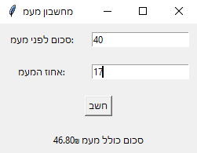

# מחשבון מעמ

  

## מטרת הפרוייקט

פרויקט זה הוא מחשבון מע"מ שנועד לחשב את הסכום הכולל כולל מע"מ עבור סכום נתון ואחוז מע"מ נתון.

## טכנולוגיות שהפרוייקט ביצע בהן שימוש

- Python
- Tkinter עבור בניית ממשק המשתמש

## כיצד להשתמש במחשבון המעמ

1. הזן את הסכום לפני מע"מ בשדה המתאים.
2. הזן את אחוז המע"מ בשדה המתאים.
3. לחץ על הכפתור "חשב" כדי לקבל את הסכום הכולל כולל מע"מ.

## קרדיטים

מחשבון המע"מ נוצר על ידי [אייל גרין](https://eyalgreen.com)
